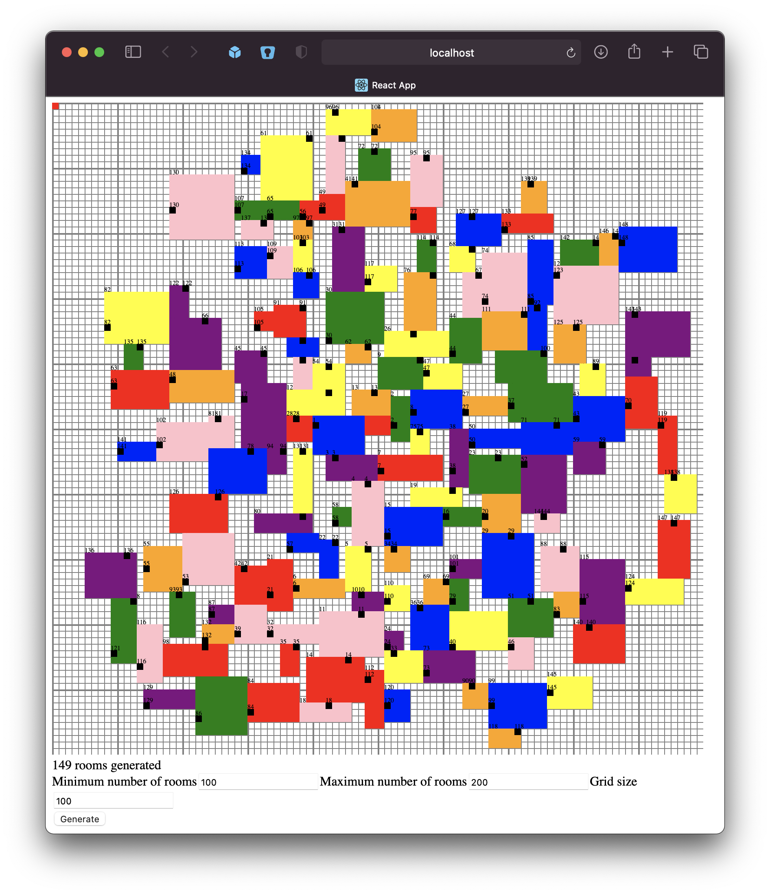
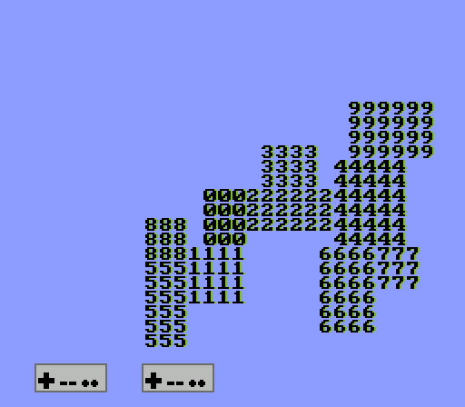

# dungeon-generator - A simple room generator example for JS and NES (Millfork)

`dungeon-generator` is a simple algorithm for proceedurally generating dungeon room layouts with the goal of running on limited hardware, such as the NES's 6502. Included is a JS playground to tweak the algorithm in a more accessible manner, and the Millfork code to run the generator + visualizer on original NES hardware.

<p align="center">
	
	
</p>

[The amazing Millfork language can be found here](https://github.com/KarolS/millfork). I would recommend running the latest version, but this project was last built and working on 0.3.19beta.

## Compilation Instructions

### JS

```
cd dungeon-generator
npm i
npm start
```

### Millfork

[Download Millfork](https://github.com/KarolS/millfork/releases)

```
cd dungeon-generator
java -jar [path to millfork.jar] ./millfork/main.mfk -i ./millfork/lib -o build/generator.nes -g -s -fsource-in-asm -t nes_small -fillegals -O4
```

Alternatively, you can use the provided VSCode build task